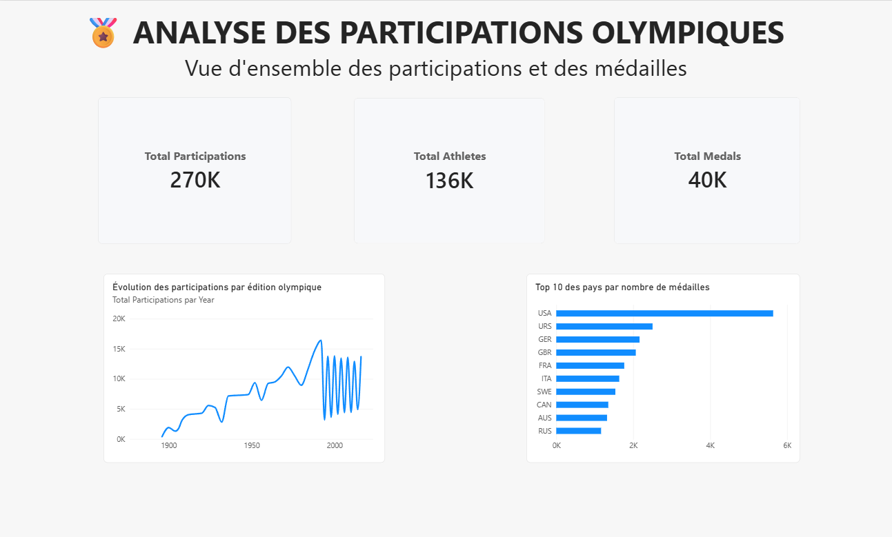
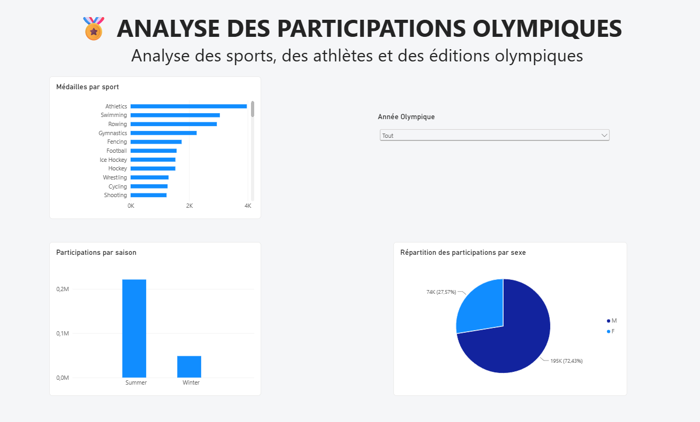

# 🏅 Data Lakehouse & Data Engineering --- Olympic Data

## 📌 Présentation

Ce projet académique met en œuvre un pipeline **Data Engineering de bout
en bout** autour de données relatives aux Jeux Olympiques.

L'objectif est de construire une architecture de type **Data Lakehouse**
suivant le principe de la **Medallion Architecture** :

**Bronze → Silver → Gold**

Le projet couvre : - ingestion des données ; - nettoyage et
transformation ; - modélisation analytique ; - stockage Parquet ; -
requêtage SQL avec DuckDB ; - stockage objet avec MinIO ; - contrôles de
qualité ; - tests Pytest ; - intégration continue avec GitHub Actions
; - visualisation avec Power BI.

## 🎯 Problématique métier

> **Comment analyser l'évolution de la participation olympique et
> identifier les tendances selon les pays, les sports, les athlètes et
> les éditions ?**

Le dashboard Power BI permet notamment d'analyser les participations,
athlètes, médailles, éditions, pays, sports, sexe et saisons olympiques.

## 🏗️ Architecture

``` text
Sources
  │
  ▼
BRONZE ── données brutes
  │
  ▼
SILVER ── données nettoyées / Parquet
  │
  ▼
GOLD ──── modèle analytique
  │
  ├── DuckDB
  ├── MinIO
  └── Power BI
```

## 🥉 Bronze

Sources principales :

``` text
athlete_events.csv
wikidata_olympic.csv
```

## 🥈 Silver

La couche Silver contient les données nettoyées et transformées,
notamment :

-   traitement des valeurs manquantes ;
-   contrôle des types ;
-   traitement des doublons ;
-   préparation à la modélisation.

Fichiers principaux :

``` text
athlete_events_clean.parquet
wikidata_olympic_clean.parquet
```

## 🥇 Gold

Le modèle analytique comprend :

  Table                 Description
  --------------------- -------------------------------
  `DimAthlete`          Informations sur les athlètes
  `DimSport`            Informations sur les sports
  `DimOlympics`         Informations sur les éditions
  `DimCountry`          Informations sur les pays
  `FactParticipation`   Participations des athlètes

## 🗄️ DuckDB, Parquet et MinIO

DuckDB sert de moteur SQL analytique local.

La base utilisée est :

``` text
data/olympics.duckdb
```

Les données analytiques sont stockées en Parquet.

MinIO fournit les buckets :

``` text
bronze
silver
gold
```

Le bucket Gold contient notamment :

``` text
DimAthlete.parquet
DimSport.parquet
DimOlympics.parquet
DimCountry.parquet
FactParticipation.parquet
```

## 🧪 Tests et qualité

Les tests Pytest couvrent notamment :

-   colonnes obligatoires ;
-   doublons ;
-   types ;
-   données non vides ;
-   unicité des identifiants ;
-   qualité des fichiers Parquet.

Exécution :

``` bash
python3 -m pytest -v
```

## ⚙️ CI --- GitHub Actions

GitHub Actions exécute automatiquement les tests sur :

-   `push` ;
-   `pull request`.

Le workflow installe notamment Python, Pandas, Pytest, PyArrow et
DuckDB.

Commande exécutée :

``` bash
python -m pytest -v
```

## 📊 Dashboard Power BI

Le modèle Power BI utilise :

``` text
DimAthlete
DimSport
DimOlympics
DimCountry
FactParticipation
```

Les relations suivent une logique de modèle en étoile.

### Mesures DAX

``` dax
Total Participations =
COUNTROWS(FactParticipation)
```

``` dax
Total Athletes =
DISTINCTCOUNT(FactParticipation[athlete_id])
```

``` dax
Total Medals =
CALCULATE(
    COUNTROWS(FactParticipation),
    FactParticipation[Medal] <> BLANK()
)
```

### 📈 Page 1 --- Vue d'ensemble

La page présente les KPI de participations, athlètes et médailles,
l'évolution des participations par année et le Top 10 des pays par
médailles.



### 📊 Page 2 --- Analyse détaillée

La seconde page présente les médailles par sport, la répartition des
participations par sexe, les participations selon la saison et un filtre
par année.



## 🛠️ Technologies

  Technologie      Utilisation
  ---------------- -----------------------------
  Python           Pipeline Data Engineering
  Pandas           Transformation des données
  SQL              Transformations et analyses
  DuckDB           Moteur analytique
  Parquet          Stockage analytique
  MinIO            Stockage objet
  Pytest           Tests
  PyArrow          Support Parquet
  Git / GitHub     Versionnement
  GitHub Actions   CI
  Power BI         Visualisation
  DAX              Mesures analytiques

## 📁 Structure

``` text
data-lakehouse-portfolio/
├── data/
├── scripts/
│   ├── bronze_ingestion.py
│   ├── silver_processing.py
│   ├── gold_processing.py
│   ├── transformations.py
│   ├── analytics_queries.py
│   ├── queries.sql
│   └── utils.py
├── tests/
│   ├── test_transformations.py
│   ├── test_data_quality.py
│   └── test_parquet_quality.py
├── powerbi/
│   └── olympics_dashboard.pbix
├── docs/
│   ├── dashboard_page1.png
│   └── dashboard_page2.png
├── .github/
│   └── workflows/
│       └── tests.yml
├── .gitignore
└── README.md
```

> Les fichiers Parquet et DuckDB générés localement ne sont pas destinés
> à être versionnés dans Git.

## 🚀 Installation

### Prérequis

-   Python 3
-   Git
-   MinIO

### Cloner le projet

``` bash
git clone https://github.com/alimahha/data-lakehouse-portfolio.git
cd data-lakehouse-portfolio
```

### Environnement virtuel

``` bash
python3 -m venv .venv
source .venv/bin/activate
```

### Dépendances

``` bash
python -m pip install --upgrade pip
pip install pandas pyarrow duckdb pytest minio
```

## 🗃️ Configuration MinIO

Créer les buckets :

``` bash
mc mb local/bronze
mc mb local/silver
mc mb local/gold
```

Vérifier :

``` bash
mc ls local
```

## ▶️ Exécution

### Bronze

``` bash
python3 scripts/bronze_ingestion.py
```

### Silver

``` bash
python3 scripts/silver_processing.py
```

### Gold

``` bash
python3 scripts/gold_processing.py
```

## 🎯 Compétences mises en pratique

-   architecture Medallion ;
-   pipeline Data Engineering ;
-   Python et SQL ;
-   Parquet ;
-   DuckDB ;
-   MinIO ;
-   modélisation dimensionnelle ;
-   qualité des données ;
-   Pytest ;
-   GitHub Actions ;
-   Power BI ;
-   DAX.

## 🔮 Évolutions possibles

-   industrialisation sur le Cloud ;
-   Data Lake Cloud ;
-   orchestration ;
-   contrôles de qualité avancés ;
-   nouvelles sources ;
-   automatisation du déploiement ;
-   intégration possible avec Azure, Databricks ou Dataiku.

## 👤 Auteurs

**Ali Mahha**

Projet Personnel --- Data Lakehouse & Data Engineering
